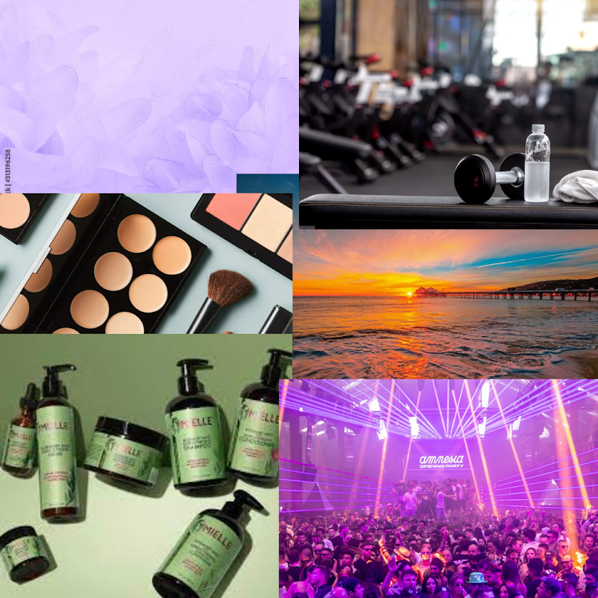

<!DOCTYPE html>
<html lang="en">
<head>
	<meta charset="utf-8">
	<title>Anaylis Ortega</title>
</head>
<body background="pink" bgcolor="white" link="light blue" alink="light blue" vlink="light blue">

<!--Links at the top-->	
	<h3 id="top" align="center"><b>
			<a href="#about">ABOUT</a>
			<a href="#experience">EXPERIENCE</a>
			<a href="#interests">INTERESTS</a>
			<a href="#social">SOCIAL</a>
			<a href="#linkedin">LINKEDIN</a>
                       <a href="#porfolio">PORFOLIO</a>
	</b></h3> 

<!--Introduction with picture-->
	<table bgcolor="white" width="90%" align="center"><tr>
	    <td></td>
	    <td><h4>Hello, world. I am Anaylis, I'm a soon to graduate senior from Bronx Early College academy. One of my favorite hobbies is to work out, i've been on my gym journey since i was 14. But for some reason I've always been on and off, Which is why I haven't reached my goal yet.</h4></td>
	</tr></table> 

<!--About Me-->
	<h1 id="about" align="center">
		About Me
	</h1>
	
		It aint no secret that I am a  gym rat. I have been focusing a lot on my gym core lately but the only thing that throws me off is the eating. Due to that you have to be on a balanced diet or at least good enough to burn them down at each workout section. In my case I have a trainer that helps me out a lot but however no matter how hard he tries to help me, I know that it depends on me to be accountable on my own.  
	   

<!--My Experience-->
	<h1 id="experience" align="center">
		Experience
	</h1>
	
		<ul>
		    <li>My work experience includes Gym Trainer Assistant</li>
		    <li>My volunteer experience includes Gods Love We deliver, Community clean up, and English Tutoring.</li>
		    <li>My soft skills include communication, time management, and teamwork. </li>
		    <li>My hard skills include computer skills in github, spreadsheets, and google slides.</li>    
		</ul>
	 
	
<!--Interests-->
	<h1 id="interests" align="center">
		Interests
	</h1>
	
		My interests include getting my gym goals done but before that I'm focusing on graduating early in order to just focus on getting my goals set before I turn 18. Because i do have other priority in mind such as getting a job in order to pay my expenses and being able to get my own place 
	   

<!--Visual Design Portfolio-->
	<h1 id="portfolio" align="center">
			Visual Design Portfolio
	</h1>
   	<table width="90%" align="center"><tr>
		<td align="center"></td>
   		<td align="center"></td>
		<td align="center"></td>
   	</tr><tr>
   		<td>Piece 1:In this piece of art I was inspired by my favorite holiday which is holloween. I used an art software to make a surreal, dark and vibrant piece of art with an abstract appeal.</td>
   		<td>Piece 2:In this piece I wanted to make something with political significance showing the current suffering happpening in Palestine during these times of war. I used multiple images and collaged them together.</td>
   		<td>Piece 3: In this piece I put together a bunch of images that represent my type of "vibe" that I love. This is a collage of things that represent who I am but also provide some type of comfort.</td>
   	</tr></table> 

<!--Link to the top-->
	<h1 align="center">
	 <a href="#top">BACK TO THE TOP</a>
	</h1>
</body>
</html>
 
